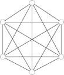
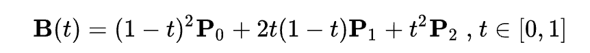

# 多智能体系统实验

<p align="right" >58120309 王玟雯</p>

## 1.1	全局耦合网络

### 任务内容：实现全局耦合网络，展示网络图，并计算平均路径长度和聚类系数。

网络描述：无向图，任意两个节点之间均有边相连

<div align=center></div>

明确每个性质的含义和计算方法：
展示网络图：

#### 计算平均路径长度(L):

任意两节点间最短路径长度d的平均值（最短路径长度可由广度优先搜索算法来确定）
具体算式：

在代码中的表示：

```python
L = 2 * 1/2 * shortest_path(mat).sum()/(nodes_num * (nodes_num - 1))
```

#### 计算聚类系数(C):

朋友之间还是朋友
具体算式：

在代码中的表示：

```python
C = [2 * findNeighbor(mat,i)/(k[i]* (k[i] -1 )) for i in range(nodes_num)]
```

针对于全局耦合网络，我们已知其基本性质:

- $K_{GC} = |A| - 1 (节点的度)$
- $L_{GC} = 1 (平均路径长度)$
- $C_{GC} = 1 (聚类系数)$

### 代码设计过程：

本次采用 ``strealit``设计后端，以方便以在线网页的形式展示变成成果。

生成相应矩阵类型的邻接矩阵。横纵每一格都代表一个节点，若相连则为1，不相连或者对角线上则为0：

```python
def draw_mat(nodes_num, type):
  
    if type == '1.1: global_coupled_network':
        df = pd.DataFrame(data=np.ones(shape=(nodes_num,nodes_num)),columns=(i+1 for i in range(nodes_num)))
        # change dataframe raw name, using data.index, directly change it.
        df.index = df.columns
        df = formalize(df)
      
        return df
```

设计计算出特征的 ``calcu``函数，输入邻接矩阵可以直接获得 ``k（度）``，``L（平均路径长度）``，``C（聚类系数）``：

```python
def calcu(mat):
    """_summary_
    Args:
        mat (pandas.dataframe(nodes_num, nodes_num)): 表示了相应交互结构的矩阵表示
    Returns:
        度(k) (lists(nodes_num)): 每一个节点的度
        路径长度(L) (float): 任意两节点间最短路径长度d的平均值（最短路径长度可由广度优先搜索算法来确定）
        聚类系数(C) (lists(nodes_num)): 表示了每个节点的聚类系数值
    """
    nodes_num = mat.shape[0]
    k = [mat[i].sum() for i in range(nodes_num)]
    L = 2 * 1/2 * shortest_path(mat).sum()/(nodes_num * (nodes_num - 1))
    C = [2 * findNeighbor(mat,i)/(k[i]* (k[i] -1 )) for i in range(nodes_num)]
  
    return k, L, C
```

下面的 ``findNeighbor``和 ``shortest_path``是为了 ``calcu``函数设计的utils function。前者找出某个节点 ``node_idx``邻居互联的数量，后者使用广度优先算法搜索每一个点到另外一个的最短距离。

```python
def findNeighbor(mat, node_idx):
    # tuple 
    neighbor = np.where(mat[node_idx] == 1)
    # Equal: num = np.isin(np.where(mat[neighbor]==1)[0], neighbor).sum() / 2
    num = mat[neighbor][:,neighbor].sum() / 2
    return num.astype('int32')
def shortest_path(matrix):
    """_summary_
    使用广度优先算法搜索每一个点到另外一个的最短距离
    Args:
        mat (pandas.dataframe(nodes_num, nodes_num)): 表示了相应交互结构的矩阵表示
    Returns:
        leastLengthMat (np.array(nodes_num, nodes_num)): 一个满矩阵，每个值代表从i点到j点的最短路径长度
    """
    node_number = len(matrix)
    output_matrix = [[0 for _ in range(node_number)] for _ in range(node_number)]
    for i in range(node_number):
        visited = [False] * node_number
        queue = deque([(i, 0)])
        while queue:
            node, dist = queue.popleft()
            if visited[node]:
                continue
            visited[node] = True
            output_matrix[i][node] = dist
            for j in range(node_number):
                if matrix[node][j] == 1:
                    queue.append((j, dist + 1))
    return np.array(output_matrix)
```


随机网络 （ER随机图）

任意两点间以一定概率p建立交互连接
基本性质

krandom = p(|A|-1)
Lrandom ∝ ln|A|/ln krandom
Crandom = p 

WS小世界模型 （Watts&Strogtz,1998）
构建方法：

建立规则图
建立一个含有N个节点的最近邻耦合网络，每个节点与左右相邻的K/2个邻居节点连接（K为偶数）；

随机化重连
以概率p随机地重连网络中的每条边（即将边的一端节点保持不变，而将另一端点选择为网络中的随机选择的一个节点）。

NOTE：任意两个节点间只能有一条边，且每一节点不允许有边与自身相连。


二次方贝塞尔曲线的路径由给定点P0、P1、P2的函数B（t）追踪：



TrueType字体就运用了以贝兹样条组成的二次贝塞尔曲线。
